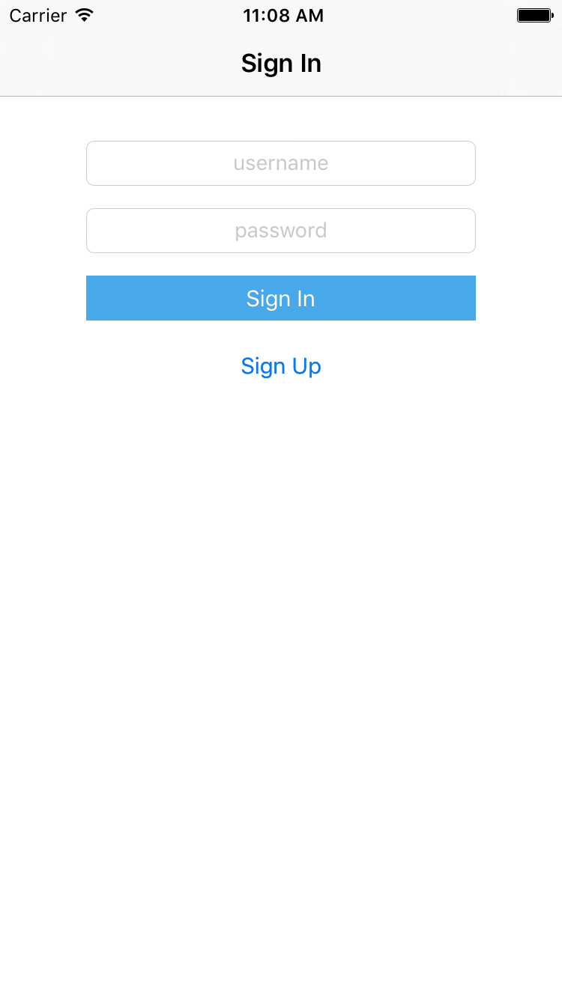
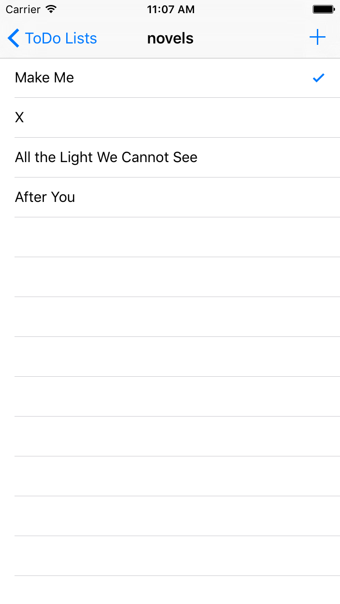

# Sample-Todo-iOS

## Overview

This project teaches you how to sign in and sign up, and display a list, add or delete an element using MaxLeap.

## Features

- Sign Up
- Sign In
- Create MLObject, create a todo list or item
- Add Relation to MLObjects
- Query MLObject
- Delete MLObject

## Screenshots 

## How to Run

- Clone the repository and open the project.
- Create an app in leap.as console and name it MaxLeap App. You can skip this step if you've already created one.
- Add your applicationID and clientKey of MaxLeap App in `AppDelegate.`. 
- Press <kbd>Command</kbd> + <kbd>R</kbd> to run it.

## Learn More

Please check official [MaxLeap iOS Guide](https://maxleap.cn/en_us/guide/devguide/ios.html) to learn more details.
